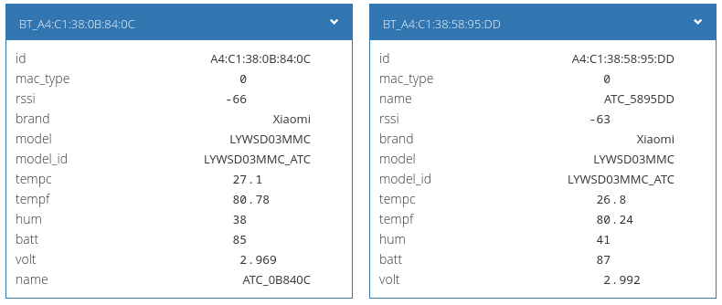

# omg2wb
## Описание
Конвертер mqtt-топиков [OpenMQTTGateway](https://docs.openmqttgateway.com) в нотацию Wiren Board.

Конвертер поддерживает режимы:
* BLE gateway — популярные BLE датчики Mi Flora, Mi jia, LYWDS02, LYWSD03MMC, ClearGrass, Mi scale [подробнее](https://docs.openmqttgateway.com/use/ble.html#receiving-signals-from-ble-beacon-devices-for-presence-detection)
* Sensors: ADC, DHT, HTU21, AHTx0 (AHT10 and AHT20), DS18x20, HCSR501 [подробнее](https://docs.openmqttgateway.com/use/sensors.html).

## Настройка подключения в OpenMQTTGateway

